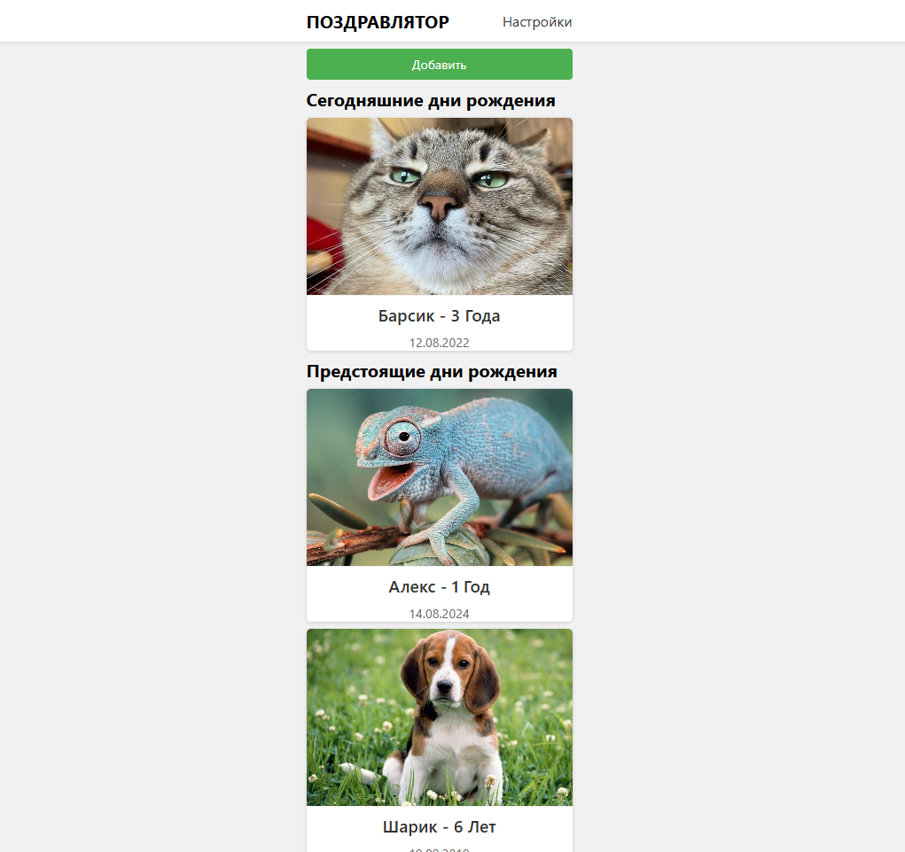

# 🎉 BirthDateReminder

**BirthDateReminder** — это веб-приложение на ASP.NET Core, которое помогает пользователям не забывать о днях рождения друзей и близких. Оно автоматически отправляет email-напоминания в нужный день или заранее, в зависимости от настроек пользователя.

---

## 🖼️ Скриншоты

### 📋 Главная страница со списком дней рождения


### ➕ Добавление нового дня рождения


### ⚙️ Настройки уведомлений пользователя


### 📧 Пример email-напоминания


---

## 🚀 Основные возможности

- 👤 Регистрация и вход с помощью ASP.NET Identity
- 📅 Добавление и редактирование дней рождения
- 🔔 Настройка уведомлений:
  - В день рождения
  - За день до
- 📧 Автоматическая отправка email-напоминаний
- 🖼 Загрузка изображений 
- 🔐 JWT-аутентификация для API
- 🧠 Умная фоновая служба, которая проверяет дни рождения каждый день

---

## 🛠️ Технологии

- ASP.NET Core
- Entity Framework Core + SQLite
- ASP.NET Identity
- JWT (JSON Web Tokens)
- SMTP (Mail.ru)
- DotNetEnv (.env-файлы)

---

## ⚙️ Установка и запуск

### 1. Клонировать репозиторий

```bash
git clone https://github.com/MatAndrey/BirthDateReminder.git
cd BirthDateReminder
```

### 2. Создать `.env` файл

Создай файл `.env` на основе `.env.example`:

```env
AllowedHosts=*
ConnectionStrings__DefaultConnection=Data Source=app.db

FileStorage__ImagePath=wwwroot/uploads/images

Jwt__Audience=BirthDateReminder.Client
Jwt__ExpireHours=24
Jwt__Issuer=BirthDateReminder.Server
Jwt__Key=

Logging__LogLevel__Default=Information
Logging__LogLevel__Microsoft.AspNetCore=Warning

Smtp__From=birthdayreminder@mail.ru
Smtp__Host=smtp.mail.ru
Smtp__Password=
Smtp__Port=587
Smtp__Username=birthdayreminder@mail.ru

StaticFiles__ServeUnknownFileTypes=True
```

### 3. Применить миграции

```bash
dotnet ef database update
```

### 4. Запустить приложение

```bash
dotnet run
```

Открой в браузере: `https://localhost:49482`
